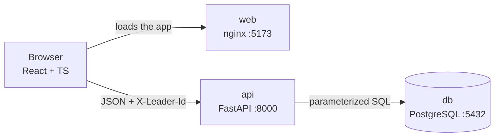

# Leader evaluations

A web app where a leader evaluates the people below them in the hierarchy, direct and indirect.
Each evaluation has 6 weighted questions scored from 1 to 4. A leader can evaluate the same person
once per week, an evaluation can never be changed, and a leader only sees evaluations of people
below them.

**Stack:** PostgreSQL 17 · FastAPI (Python 3.12, psycopg 3, raw SQL) · React 19 + TypeScript (Vite) · Docker Compose

## Run it

Requirements: Docker with Compose. That is all the app needs; the tests also need Python and Node on
the host (see [Run the tests](#run-the-tests)).

```bash
cp .env.example .env
docker compose up --build
```

| What | Where |
|---|---|
| App | http://localhost:5173 |
| API | http://localhost:8000 |
| Interactive API docs (OpenAPI) | http://localhost:8000/docs |

The database is created and seeded from `db/init` the first time the volume is created.
To start again from a clean database: `docker compose down -v`.
If port 5432, 8000 or 5173 is already in use (for example by a local PostgreSQL), stop that
service or change the host port in `docker-compose.yml`.

## Try it

There is no login (as the challenge allows): choose who you are in "Você é", at the top. The choice
is kept in `localStorage`, so it survives a page reload. A walk-through that covers every rule:

1. **James Watanabe** has nobody below him: the list is empty.
2. As **Henry Patel**, open James and click **Avaliar**. Answer the 6 questions and send.
   The evaluation shows up as the highlight, in the detail and in the list.
3. Evaluate James again as Henry: *"Você já avaliou essa pessoa nesta semana."* (409).
4. As **Bob Sinclair** (Henry's leader's leader), evaluate James. Bob's evaluation becomes the
   highlight, and Henry's moves to the history below it.
5. Back as Henry: Bob's evaluation is not visible. Henry only sees evaluations made by himself
   or by people below him.

## Architecture and flow



1. The user picks who they are; the choice is saved in `localStorage` and sent as `X-Leader-Id`.
2. **Routers** validate the request with Pydantic (scores 1–4, no repeated question).
3. **Services** apply the rules: all 6 questions answered, the employee below the leader (recursive
   query), and the score computed from the weights.
4. **Repositories** run the SQL. An evaluation and its answers are saved in one transaction; the
   `UNIQUE` constraint turns a second evaluation in the same week into a 409.

**Configuration and keys:** everything lives in `.env`, copied from `.env.example`. There are no
external API keys; the only secrets are the local database credentials.

## API

Every endpoint that depends on who is asking reads the leader from the `X-Leader-Id` header
([decision g](docs/decisions.md#g-how-the-api-identifies-the-current-leader)).

| Method and path | What it returns | Errors |
|---|---|---|
| `GET /employees` | Everyone (`id`, `name`), for the leader selector | |
| `GET /subordinates` | People below the leader, direct and indirect: `id`, `name`, `position_name` and `highlight` (`leader_name`, `week_start`, `final_score`) or `null` | 404 leader not found |
| `GET /questions` | The 6 questions: `id`, `label`, `weight` | |
| `POST /evaluations` | Body `{employee_id, answers: [{question_id, score}]}`. Returns 201 with `id`, `week_start`, `final_score` | 403 not below the leader · 409 already evaluated this week · 422 invalid answers |
| `GET /employees/{id}/evaluations` | The evaluations the leader may see, highlight first (highest evaluator, then newest week), each with `leader_name`, `week_start`, `final_score` and the 6 `answers` (`label`, `weight`, `score`) | 403 not below the leader |
| `GET /health` | `{"status": "ok"}` when the database answers | |

`final_score` = `sum(score × weight) / 100`, from 1.00 to 4.00, computed once at submission
([decision e](docs/decisions.md#e-final-score-stored-or-computed)).

## Main decisions

The full reasoning, with the alternatives that were discarded, is in [docs/decisions.md](docs/decisions.md).
In short:

- **A week** is an ISO week (Monday to Sunday) in `America/Sao_Paulo`, stamped by the server (a).
- **"Highest hierarchy"**: the highlight is the evaluation from the evaluator closest to the viewer,
  even if it is older. Evaluations from peers or superiors are never shown (b).
- **The database enforces the rules**: `UNIQUE (leader_id, employee_id, week_start)` gives "one per
  week" even with a double click, and a trigger rejects any `UPDATE` or `DELETE` (f).
- **The hierarchy is many-to-many**, so the recursive query keeps the shortest distance and stops
  on cycles with `CYCLE` (i).
- **One visibility rule**, written once in SQL and used by both the list and the detail, with no
  N+1 (j).

Data model: [docs/er-diagram.md](docs/er-diagram.md).

## Run the tests

The tests use a separate database, `monks_test`, on the same Postgres, rebuilt from `db/init` on
every run, so they never touch the data of the running app ([decision h](docs/decisions.md#h-tests-run-against-a-separate-database)).

Requirements on the host: Python 3.12+ with `venv` (on Debian/Ubuntu: `sudo apt install python3-venv`),
and Node 24 for the front end checks.

```bash
docker compose up -d db
cd backend
python3 -m venv .venv && source .venv/bin/activate
pip install -r requirements-dev.txt
pytest
```

Front end checks: `cd frontend && npm ci && npm run build && npm run lint`.

## Project layout

```
backend/app/
  routers/       HTTP: parameters, status codes
  services/      business rules (who may evaluate, score)
  repositories/  SQL (visibility.py holds the visibility rule)
backend/tests/   pytest, against monks_test
frontend/src/
  api.ts         typed fetch calls
  components/    LeaderSelector, SubordinateList, EvaluationDetail, EvaluationForm
db/init/         schema and seed, run by Postgres on first start
docs/            decisions and data model
```

## Limitations

- **No authentication**, as the challenge states: any client can send any `X-Leader-Id`. The API still
  checks that the leader exists and only returns people below them. Real login would only change
  how that header is filled.
- **Schema changes** live in `db/init`, which runs only when the database is first created. A real
  project would use migrations (e.g. Alembic).
- **No end-to-end tests in the repo**: the screen was checked with the walk-through above.
