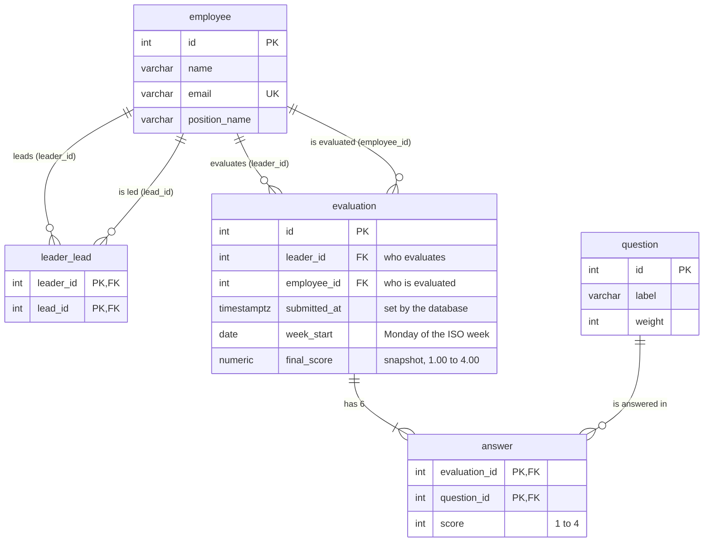

# Entity-relationship diagram

```mermaid
erDiagram
    employee ||--o{ leader_lead : "leads (leader_id)"
    employee ||--o{ leader_lead : "is led (lead_id)"
    employee ||--o{ evaluation : "evaluates (leader_id)"
    employee ||--o{ evaluation : "is evaluated (employee_id)"
    evaluation ||--|{ answer : "has 6"
    question ||--o{ answer : "is answered in"

    employee {
        int id PK
        varchar name
        varchar email UK
        varchar position_name
    }
    leader_lead {
        int leader_id PK, FK
        int lead_id PK, FK
    }
    evaluation {
        int id PK
        int leader_id FK "who evaluates"
        int employee_id FK "who is evaluated"
        timestamptz submitted_at "set by the database"
        date week_start "Monday of the ISO week"
        numeric final_score "snapshot, 1.00 to 4.00"
    }
    answer {
        int evaluation_id PK, FK
        int question_id PK, FK
        int score "1 to 4"
    }
    question {
        int id PK
        varchar label
        int weight
    }
```

Unique rule: one evaluation per (leader_id, employee_id, week_start).
Reasoning for each choice: [decisions.md](decisions.md).
